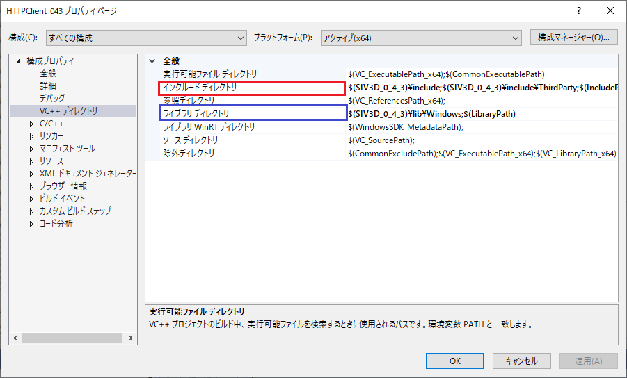
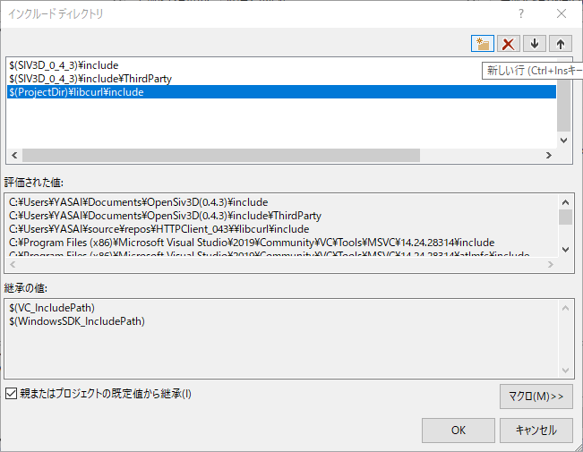

# OpenSiv3D HTTPClient
HTTPClient class for OpenSiv3D v0.4.3 (experimental)
https://github.com/Siv3D/OpenSiv3D/issues/482

## Requirements

- libcurl

## Supported Platform

- [x] Windows
- [ ] macOS (準備中)
- [x] Linux (Experimental)

## Authors

- [野菜ジュース](https://twitter.com/yasaijuice03)
- [Reputeless](https://twitter.com/Reputeless)

## How to use(導入方法)

Windows(Visual Studio 2019)

  
  
1. このリポジトリのdocs_image以外のファイルをプロジェクトファイル以下に展開します。  
2. プロジェクトのプロパティを開き、構成をすべての構成に変更します。  
3. [VC++ディレクトリ] -> [インクルードディレクトリ(画像赤枠)]の編集に入ります。  
  
4. 新しい行をクリックし、そこに`$(ProjectDir)\libcurl\include`(もしくは自分が配置したディレクトリ)と書きOKを押します。  

5. 3.と同様に[ライブラリディレクトリ(画像青枠)]の編集に入ります。  
6. 4.と同様に新しい行に`$(ProjectDir)\libcurl\lib`(もしくは自分が配置したディレクトリ)と書きOKを押し、適用します。  

### Linux
https://github.com/Siv3D/OpenSiv3D_HTTPClient/issues/1
